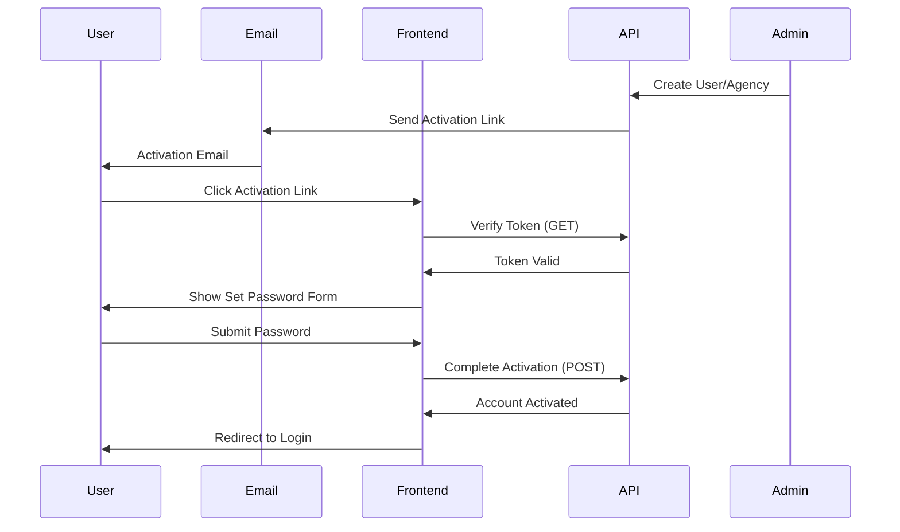

# Account Activation API Documentation

## Base URL
```
/api/v1/activation
```

## Overview
The Activation API handles secure account activation for newly created users and agencies. The activation process uses email-based verification with secure tokens and requires users to set their own password.

---

## Activation Flow



---

## Endpoints

### 1. Verify Activation Token
Validates the activation link from email and retrieves user information.

**Endpoint:** `GET /activation/verify`
**Authentication:** None (token-based)
**Rate Limit:** 3 attempts per token

#### Query Parameters
| Parameter | Type | Required | Description |
|-----------|------|----------|-------------|
| token | string | Yes | Activation token from email |
| userId | CUID | Yes | User identifier |

#### Example Request
```
GET /activation/verify?token=abc123def456...&userId=clxxx123456
```

#### Success Response
```json
{
  "success": true,
  "message": "Activation token is valid",
  "data": {
    "email": "user@example.com",
    "accountType": "USER"
  }
}
```

#### Account Types
- `AGENCY_ADMIN`: First admin user of a newly created agency
- `USER`: Regular staff user created by an admin

#### Error Responses

**Invalid/Expired Token**
```json
{
  "success": false,
  "error": "Invalid or expired activation link. Please request a new one.",
  "statusCode": 400
}
```

**Token Already Used**
```json
{
  "success": false,
  "error": "This activation link has already been used.",
  "statusCode": 400
}
```

**Too Many Failed Attempts**
```json
{
  "success": false,
  "error": "Too many failed attempts. Account locked for 24 hours.",
  "statusCode": 429
}
```

---

### 2. Complete Activation
Completes account activation by setting the user's password.

**Endpoint:** `POST /activation/complete`
**Authentication:** None (token-based)

#### Request Body
```json
{
  "userId": "clxxx123456",
  "token": "abc123def456...",
  "password": "SecurePass123!",
  "confirmPassword": "SecurePass123!"
}
```

#### Validation Rules

**userId**
- Format: Valid CUID2
- Required: Yes

**token**
- Type: String
- Required: Yes
- Must match the token sent in activation email

**password**
- Minimum length: 8 characters
- Must contain at least 3 of:
  - Uppercase letters (A-Z)
  - Lowercase letters (a-z)
  - Numbers (0-9)
  - Special characters (!@#$%^&*(),.?":{}|<>)
- Examples:
  - ✅ `Password123!`
  - ✅ `SecureP@ss456`
  - ✅ `MyStr0ngPwd!`
  - ❌ `password` (too weak)
  - ❌ `12345678` (no letters)
  - ❌ `Pass1` (too short)

**confirmPassword**
- Must exactly match `password`

#### Success Response
```json
{
  "success": true,
  "message": "Account activated successfully. You can now login."
}
```

#### Error Responses

**Validation Errors**
```json
{
  "success": false,
  "error": "Validation failed",
  "statusCode": 400,
  "details": [
    {
      "field": "password",
      "message": "Password must be at least 8 characters long"
    }
  ]
}
```

**Password Mismatch**
```json
{
  "success": false,
  "error": "Validation failed",
  "statusCode": 400,
  "details": [
    {
      "field": "confirmPassword",
      "message": "Passwords do not match"
    }
  ]
}
```

**Weak Password**
```json
{
  "success": false,
  "error": "Validation failed",
  "statusCode": 400,
  "details": [
    {
      "field": "password",
      "message": "Password must contain at least 3 of: uppercase, lowercase, numbers, special characters"
    }
  ]
}
```

**Invalid Token**
```json
{
  "success": false,
  "error": "Invalid activation token",
  "statusCode": 401
}
```

---

### 3. Resend Activation Email
Requests a new activation email if the previous one expired or was lost.

**Endpoint:** `POST /activation/resend`
**Authentication:** None
**Rate Limit:** 1 request per 5 minutes per user

#### Request Body
```json
{
  "userId": "clxxx123456"
}
```

#### Success Response
```json
{
  "success": true,
  "message": "Activation email sent successfully"
}
```

#### Error Responses

**Already Activated**
```json
{
  "success": false,
  "error": "Account is already activated",
  "statusCode": 400
}
```

**Too Many Requests**
```json
{
  "success": false,
  "error": "Please wait before requesting a new activation email.",
  "statusCode": 429
}
```

**User Not Found**
```json
{
  "success": false,
  "error": "User not found",
  "statusCode": 404
}
```

---

## Frontend Integration Guide

### Step 1: Email Link Click
When users click the activation link in their email, extract the query parameters:

```javascript
// Example URL from email:
// https://yourapp.com/activate-account?token=abc123...&userId=clxxx123456

const urlParams = new URLSearchParams(window.location.search);
const token = urlParams.get('token');
const userId = urlParams.get('userId');

if (!token || !userId) {
  // Handle missing parameters
  showError('Invalid activation link');
  return;
}
```

### Step 2: Verify Token
Validate the token before showing the password form:

```javascript
async function verifyActivationToken(userId, token) {
  try {
    const response = await fetch(
      `/api/v1/activation/verify?token=${token}&userId=${userId}`,
      { method: 'GET' }
    );

    const data = await response.json();

    if (!data.success) {
      // Handle invalid token
      if (response.status === 400) {
        showError('This activation link has expired or is invalid.');
        showResendOption(userId);
      } else if (response.status === 429) {
        showError('Too many attempts. Please try again later.');
      }
      return null;
    }

    return data.data; // { email, accountType }
  } catch (error) {
    showError('Network error. Please try again.');
    return null;
  }
}

// Usage
const verification = await verifyActivationToken(userId, token);
if (verification) {
  showPasswordForm(verification.email, verification.accountType);
}
```

### Step 3: Complete Activation
Submit the password form:

```javascript
async function completeActivation(userId, token, password, confirmPassword) {
  try {
    const response = await fetch('/api/v1/activation/complete', {
      method: 'POST',
      headers: {
        'Content-Type': 'application/json'
      },
      body: JSON.stringify({
        userId,
        token,
        password,
        confirmPassword
      })
    });

    const data = await response.json();

    if (!data.success) {
      // Handle errors
      if (data.details) {
        // Validation errors
        data.details.forEach(error => {
          showFieldError(error.field, error.message);
        });
      } else {
        showError(data.error);
      }
      return false;
    }

    // Success!
    showSuccess('Account activated successfully!');

    // Redirect to login after 2 seconds
    setTimeout(() => {
      window.location.href = '/login';
    }, 2000);

    return true;
  } catch (error) {
    showError('Network error. Please try again.');
    return false;
  }
}
```

### Step 4: Resend Email (Optional)
If the activation link expired:

```javascript
async function resendActivationEmail(userId) {
  try {
    const response = await fetch('/api/v1/activation/resend', {
      method: 'POST',
      headers: {
        'Content-Type': 'application/json'
      },
      body: JSON.stringify({ userId })
    });

    const data = await response.json();

    if (!data.success) {
      showError(data.error);
      return false;
    }

    showSuccess('New activation email sent! Please check your inbox.');
    return true;
  } catch (error) {
    showError('Network error. Please try again.');
    return false;
  }
}
```

---

## Complete React Example

```javascript
import React, { useState, useEffect } from 'react';
import { useSearchParams, useNavigate } from 'react-router-dom';

export default function ActivateAccount() {
  const [searchParams] = useSearchParams();
  const navigate = useNavigate();

  const [loading, setLoading] = useState(true);
  const [error, setError] = useState(null);
  const [email, setEmail] = useState('');
  const [password, setPassword] = useState('');
  const [confirmPassword, setConfirmPassword] = useState('');
  const [submitting, setSubmitting] = useState(false);

  const token = searchParams.get('token');
  const userId = searchParams.get('userId');

  // Step 1: Verify token on mount
  useEffect(() => {
    if (!token || !userId) {
      setError('Invalid activation link');
      setLoading(false);
      return;
    }

    verifyToken();
  }, [token, userId]);

  async function verifyToken() {
    try {
      const response = await fetch(
        `/api/v1/activation/verify?token=${token}&userId=${userId}`
      );
      const data = await response.json();

      if (!data.success) {
        setError(data.error);
        setLoading(false);
        return;
      }

      setEmail(data.data.email);
      setLoading(false);
    } catch (err) {
      setError('Network error. Please try again.');
      setLoading(false);
    }
  }

  // Step 2: Submit password
  async function handleSubmit(e) {
    e.preventDefault();
    setSubmitting(true);
    setError(null);

    try {
      const response = await fetch('/api/v1/activation/complete', {
        method: 'POST',
        headers: { 'Content-Type': 'application/json' },
        body: JSON.stringify({
          userId,
          token,
          password,
          confirmPassword
        })
      });

      const data = await response.json();

      if (!data.success) {
        setError(data.error);
        setSubmitting(false);
        return;
      }

      // Success - redirect to login
      alert('Account activated successfully!');
      navigate('/login');
    } catch (err) {
      setError('Network error. Please try again.');
      setSubmitting(false);
    }
  }

  // Step 3: Resend email
  async function handleResend() {
    try {
      const response = await fetch('/api/v1/activation/resend', {
        method: 'POST',
        headers: { 'Content-Type': 'application/json' },
        body: JSON.stringify({ userId })
      });

      const data = await response.json();

      if (data.success) {
        alert('New activation email sent! Please check your inbox.');
      } else {
        alert(data.error);
      }
    } catch (err) {
      alert('Network error. Please try again.');
    }
  }

  if (loading) {
    return <div>Verifying activation link...</div>;
  }

  if (error && !email) {
    return (
      <div>
        <h1>Activation Error</h1>
        <p>{error}</p>
        <button onClick={handleResend}>Resend Activation Email</button>
      </div>
    );
  }

  return (
    <div>
      <h1>Activate Your Account</h1>
      <p>Email: {email}</p>

      <form onSubmit={handleSubmit}>
        <div>
          <label>Password</label>
          <input
            type="password"
            value={password}
            onChange={(e) => setPassword(e.target.value)}
            required
            minLength={8}
          />
          <small>
            Must be at least 8 characters and contain 3 of:
            uppercase, lowercase, numbers, special characters
          </small>
        </div>

        <div>
          <label>Confirm Password</label>
          <input
            type="password"
            value={confirmPassword}
            onChange={(e) => setConfirmPassword(e.target.value)}
            required
          />
        </div>

        {error && <p style={{ color: 'red' }}>{error}</p>}

        <button type="submit" disabled={submitting}>
          {submitting ? 'Activating...' : 'Activate Account'}
        </button>
      </form>
    </div>
  );
}
```

---

## Password Strength Validator

```javascript
function validatePasswordStrength(password) {
  const errors = [];

  if (password.length < 8) {
    errors.push('Password must be at least 8 characters long');
  }

  const hasUpperCase = /[A-Z]/.test(password);
  const hasLowerCase = /[a-z]/.test(password);
  const hasNumbers = /\d/.test(password);
  const hasSpecialChar = /[!@#$%^&*(),.?":{}|<>]/.test(password);

  const criteriaMet = [
    hasUpperCase,
    hasLowerCase,
    hasNumbers,
    hasSpecialChar
  ].filter(Boolean).length;

  if (criteriaMet < 3) {
    errors.push(
      'Password must contain at least 3 of: uppercase, lowercase, numbers, special characters'
    );
  }

  return {
    isValid: errors.length === 0,
    errors,
    strength: criteriaMet
  };
}

// Usage
const validation = validatePasswordStrength('MyPass123!');
if (!validation.isValid) {
  validation.errors.forEach(error => console.error(error));
}
```

---

## Security Notes

1. **Token Expiry**: Activation tokens expire after 1 hour (3600 seconds)
2. **Single Use**: Each token can only be used once
3. **Rate Limiting**:
   - 3 verification attempts per token
   - 1 resend request per 5 minutes
   - Account locked for 24 hours after 3 failed attempts
4. **Password Security**: Passwords are hashed using Argon2 (industry standard)
5. **No Pre-set Passwords**: Users must set their own password during activation

---

## Common Issues & Solutions

### Issue: "Activation link expired"
**Solution**: Use the resend endpoint to get a new activation email.

### Issue: "Token already used"
**Solution**: User has already activated their account. Direct them to login.

### Issue: "Too many failed attempts"
**Solution**: Account is locked for 24 hours. Contact support if urgent.

### Issue: "Password too weak"
**Solution**: Ensure password meets all strength requirements (8+ chars, 3 criteria).

### Issue: User never received email
**Possible causes**:
1. Email in spam folder
2. Email service delay (wait 5 minutes)
3. Incorrect email address (admin needs to verify)