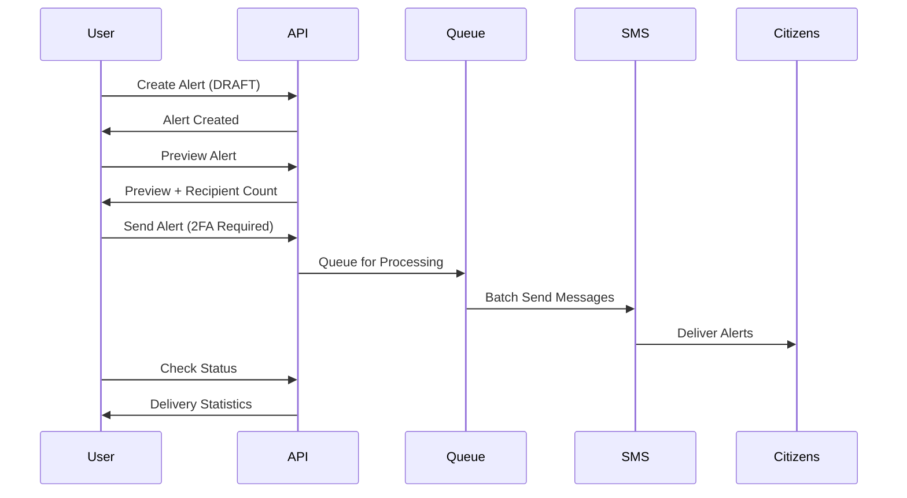

# Alert Management API Documentation

## Base URL
```
/api/v1/alert
```

## Overview
The Alert Management API is the core of GEOALERT, enabling emergency alert creation, targeting, and distribution via SMS to citizens.

**Access Control**:
- **Read**: All authenticated users
- **Write**: Admin, Coordinator, Operator roles
- **Send/Cancel**: Requires 2FA verification

---

## Alert Workflow



---

## Alert Enums

**Alert Categories:**
- `WEATHER`: Storms, floods, etc.
- `SECURITY`: Threats, incidents
- `HEALTH`: Outbreaks, medical
- `FIRE`: Fire emergencies
- `TRANSPORT`: Road/traffic alerts
- `ENVIRONMENTAL`: Pollution, hazards
- `INFRASTRUCTURE`: Utilities, services
- `OTHER`: Miscellaneous

**Severity Levels:**
- `EXTREME`: Extraordinary threat to life/property
- `SEVERE`: Significant threat
- `MODERATE`: Possible threat
- `MINOR`: Minimal threat

**Urgency Levels:**
- `IMMEDIATE`: Act now (within minutes)
- `EXPECTED`: Likely within 1 hour
- `FUTURE`: Expected after 1 hour
- `PAST`: Event has occurred

**Alert Statuses:**
- `DRAFT`: Created but not sent
- `PENDING`: Queued for delivery
- `SENT`: Delivery in progress
- `COMPLETED`: All messages sent
- `CANCELLED`: Cancelled before completion

**Target Types:**
- `STATE`: Entire state
- `LGA`: Local Government Area
- `WARD`: Ward (smallest admin unit)
- `RADIUS`: Circular area around point
- `POLYGON`: Custom polygon area
- `PATH`: Along a path/route with buffer

---

## Endpoints

### 1. Create Alert
Creates a new alert in DRAFT status.

**Endpoint:** `POST /alert`
**Authentication:** Required (Admin/Coordinator/Operator)

#### Request Body
```json
{
  "category": "WEATHER",
  "severity": "EXTREME",
  "urgency": "IMMEDIATE",
  "headline": "Severe Flash Flood Warning - Lagos State",
  "description": "Torrential rains expected to cause severe flooding in low-lying areas. Residents should seek higher ground immediately. Avoid waterways and flooded roads.",
  "instruction": "Move to higher ground now. Do not attempt to cross flooded areas. Call 112 for emergencies.",
  "expiresAt": "2024-01-06T12:00:00.000Z",
  "incidentLocation": {
    "latitude": 6.5244,
    "longitude": 3.3792
  },
  "targets": [
    {
      "targetType": "STATE",
      "stateId": "clstate123456"
    }
  ]
}
```

#### Validation Rules

**category** (required)
- Values: See AlertCategory enum
- Example: "WEATHER"

**severity** (required)
- Values: EXTREME, SEVERE, MODERATE, MINOR
- Determines SMS formatting and urgency

**urgency** (required)
- Values: IMMEDIATE, EXPECTED, FUTURE, PAST
- Indicates time sensitivity

**headline** (required)
- Length: 10-160 characters
- Brief, action-oriented summary

**description** (required)
- Length: 20-918 characters
- Detailed information about the alert

**instruction** (optional)
- Length: 0-500 characters
- Clear action steps for recipients

**expiresAt** (optional)
- Format: ISO 8601 datetime
- Must be in the future
- Default: 24 hours from creation

**incidentLocation** (optional)
- Object: { latitude, longitude }
- Latitude: -90 to 90
- Longitude: -180 to 180
- Auto-calculated from first target if not provided

**targets** (required)
- Array: Minimum 1 target
- See Target Types section below

#### Target Types in Detail

**STATE Target**
```json
{
  "targetType": "STATE",
  "stateId": "clstate123456"
}
```

**LGA Target**
```json
{
  "targetType": "LGA",
  "stateId": "clstate123456",
  "lgaId": "cllga789012"
}
```

**WARD Target**
```json
{
  "targetType": "WARD",
  "wardId": "clward345678"
}
```

**RADIUS Target**
```json
{
  "targetType": "RADIUS",
  "centerPoint": {
    "latitude": 6.5244,
    "longitude": 3.3792
  },
  "radiusMeters": 5000
}
```
- radiusMeters: 100 to 100,000 (0.1km to 100km)

**POLYGON Target**
```json
{
  "targetType": "POLYGON",
  "targetPolygon": "POLYGON((3.3 6.5, 3.4 6.5, 3.4 6.6, 3.3 6.6, 3.3 6.5))"
}
```
- Format: WKT (Well-Known Text) format
- Coordinates: longitude latitude pairs

**PATH Target**
```json
{
  "targetType": "PATH",
  "targetPath": "LINESTRING(3.3 6.5, 3.4 6.6, 3.5 6.7)",
  "pathBufferMeters": 1000
}
```
- pathBufferMeters: 10 to 50,000 (10m to 50km)

#### Success Response
```json
{
  "success": true,
  "message": "Alert created successfully",
  "data": {
    "id": "clalert111222",
    "category": "WEATHER",
    "severity": "EXTREME",
    "urgency": "IMMEDIATE",
    "headline": "Severe Flash Flood Warning - Lagos State",
    "description": "Torrential rains expected...",
    "instruction": "Move to higher ground now...",
    "status": "DRAFT",
    "expiresAt": "2024-01-06T12:00:00.000Z",
    "createdAt": "2024-01-05T10:00:00.000Z",
    "agency": {
      "id": "clagency123",
      "name": "Lagos State Emergency Management Agency",
      "type": "EMERGENCY"
    },
    "createdBy": {
      "id": "cluser789",
      "firstName": "John",
      "lastName": "Doe",
      "email": "john@lasema.gov.ng"
    },
    "targets": [
      {
        "id": "cltarget555",
        "targetType": "STATE",
        "estimatedRecipients": 15420,
        "locationName": "Lagos State"
      }
    ]
  }
}
```

---

### 2. Estimate Recipients
Calculates recipient count before creating alert.

**Endpoint:** `POST /alert/estimate-recipients`
**Authentication:** Required (Admin/Coordinator/Operator)

#### Request Body
```json
{
  "targets": [
    {
      "targetType": "RADIUS",
      "centerPoint": {
        "latitude": 6.5244,
        "longitude": 3.3792
      },
      "radiusMeters": 5000
    }
  ]
}
```

#### Response
```json
{
  "success": true,
  "message": "Estimation calculated",
  "data": {
    "estimatedRecipients": 8250
  }
}
```

---

### 3. Preview Alert
Generates SMS preview and detailed information before sending.

**Endpoint:** `GET /alert/:alertId/preview`
**Authentication:** Required (Admin/Coordinator/Operator)

#### Response
```json
{
  "success": true,
  "message": "Alert previewed generated successfully",
  "data": {
    "alert": {
      "id": "clalert111222",
      "category": "WEATHER",
      "severity": "EXTREME",
      "urgency": "IMMEDIATE",
      "headline": "Severe Flash Flood Warning - Lagos State",
      "description": "Torrential rains expected...",
      "instruction": "Move to higher ground now...",
      "status": "DRAFT",
      "expiresAt": "2024-01-06T12:00:00.000Z"
    },
    "targets": [
      {
        "id": "cltarget555",
        "targetType": "STATE",
        "estimatedRecipients": 15420,
        "locationName": "Lagos State"
      }
    ],
    "agency": {
      "id": "clagency123",
      "name": "Lagos State Emergency Management Agency",
      "type": "EMERGENCY"
    },
    "createdBy": {
      "firstName": "John",
      "lastName": "Doe"
    },
    "smsPreview": {
      "message": "🔴 GEOALERT - EXTREME\n\nSevere Flash Flood Warning - Lagos State\n\nTorrential rains expected to cause severe flooding in low-lying areas. Residents should seek higher ground immediately.\n\nStay safe and follow instructions from authorities.",
      "characterCount": 245,
      "messageCount": 2,
      "estimatedCost": 77100
    },
    "estimatedRecipients": 15420,
    "deliveries": [],
    "capXml": "<alert>...</alert>"
  }
}
```

#### SMS Preview Fields
- **message**: Formatted SMS text with emoji
- **characterCount**: Total characters
- **messageCount**: Number of SMS parts (160 chars each)
- **estimatedCost**: Estimated cost in local currency (₦2.5 per SMS)

---

### 4. Send Alert
Queues alert for delivery to citizens.

**Endpoint:** `POST /alert/:alertId/send`
**Authentication:** Required (Admin/Coordinator/Operator)
**2FA Required:** Yes ⚠️

#### Request
No body required

#### Response
```json
{
  "success": true,
  "message": "Alert queued for massive delivery. Progress can be monitored.",
  "data": {
    "alert": {
      "id": "clalert111222",
      "status": "PENDING",
      /* ... */
    },
    "status": "PENDING"
  }
}
```

#### Post-Send Behavior
1. Alert status changed to PENDING
2. Background job queued
3. Messages sent in batches
4. Status updated to SENT then COMPLETED
5. Delivery reports tracked per recipient

---

### 5. Cancel Alert
Stops an alert from being sent.

**Endpoint:** `POST /alert/:alertId/cancel`
**Authentication:** Required (Admin/Coordinator/Operator)
**2FA Required:** Yes ⚠️

#### Request Body
```json
{
  "reason": "False alarm - sensor malfunction detected. Weather conditions normal."
}
```

#### Validation
- **reason**: 10-500 characters, required

#### Response
```json
{
  "success": true,
  "message": "Alert cancelled successfully",
  "data": {
    "id": "clalert111222",
    "status": "CANCELLED",
    "cancelReason": "False alarm - sensor malfunction detected...",
    "cancelledAt": "2024-01-05T10:15:00.000Z",
    /* ... */
  }
}
```

#### Cancel Rules
- **DRAFT**: Can be cancelled anytime
- **PENDING/SENT**: Can be cancelled (stops remaining messages)
- **COMPLETED**: Cannot be cancelled
- **Operators**: Can only cancel their own alerts
- **Admin/Coordinator**: Can cancel any agency alert

---

### 6. Get Alerts
Retrieves paginated list of alerts with filters.

**Endpoint:** `GET /alert`
**Authentication:** Required (All roles)

#### Query Parameters
| Parameter | Type | Required | Default | Description |
|-----------|------|----------|---------|-------------|
| category | AlertCategory | No | - | Filter by category |
| severity | Severity | No | - | Filter by severity |
| status | AlertStatus | No | - | Filter by status |
| startDate | ISO datetime | No | - | Filter from date |
| endDate | ISO datetime | No | - | Filter to date |
| currentPage | number | No | 1 | Page number |
| limit | number | No | 20 | Items per page (max: 100) |

#### Example Request
```
GET /alert?severity=EXTREME&status=SENT&currentPage=1&limit=20
```

#### Response
```json
{
  "success": true,
  "message": "Alerts retrieved successfully",
  "data": [
    {
      "id": "clalert111222",
      "category": "WEATHER",
      "severity": "EXTREME",
      "urgency": "IMMEDIATE",
      "headline": "Severe Flash Flood Warning - Lagos State",
      "description": "Torrential rains expected...",
      "status": "COMPLETED",
      "expiresAt": "2024-01-06T12:00:00.000Z",
      "createdAt": "2024-01-05T10:00:00.000Z",
      "agency": {
        "id": "clagency123",
        "name": "Lagos State Emergency Management Agency"
      },
      "createdBy": {
        "id": "cluser789",
        "firstName": "John",
        "lastName": "Doe"
      },
      "targets": [
        {
          "targetType": "STATE",
          "state": { "name": "Lagos State" },
          "estimatedRecipients": 15420
        }
      ],
      "_count": {
        "deliveries": 15420
      }
    }
  ],
  "pagination": {
    "total": 250,
    "currentPage": 1,
    "limit": 20,
    "totalPages": 13,
    "hasNext": true,
    "hasPrev": false
  }
}
```

---

### 7. Get Alert by ID
Retrieves detailed information about a specific alert.

**Endpoint:** `GET /alert/:alertId`
**Authentication:** Required (All roles)

#### Response
```json
{
  "success": true,
  "message": "Alert statistics retrieved",
  "data": {
    "id": "clalert111222",
    "category": "WEATHER",
    "severity": "EXTREME",
    /* ... all alert fields ... */
    "targets": [/* ... */],
    "deliveries": [
      {
        "id": "cldelivery001",
        "status": "DELIVERED",
        "queuedAt": "2024-01-05T10:05:00.000Z",
        "sentAt": "2024-01-05T10:05:15.000Z",
        "deliveredAt": "2024-01-05T10:05:20.000Z",
        "failureReason": null
      }
      // ... up to 100 recent deliveries
    ]
  }
}
```

---

### 8. Get Alert Statistics
Retrieves delivery statistics for an alert.

**Endpoint:** `GET /alert/:alertId/stats`
**Authentication:** Required (All roles)

#### Response
```json
{
  "success": true,
  "message": "Alert statistics retrieved",
  "data": {
    "total": 15420,
    "queued": 0,
    "sent": 0,
    "delivered": 15250,
    "failed": 170,
    "pending": 0,
    "successRate": 98.90,
    "failureRate": 1.10
  }
}
```

#### Statistics Fields
- **total**: Total recipients targeted
- **queued**: Waiting to be sent
- **sent**: Sent but delivery not confirmed
- **delivered**: Successfully delivered
- **failed**: Delivery failed
- **pending**: queued + sent
- **successRate**: (delivered / total) * 100
- **failureRate**: (failed / total) * 100

---

## Frontend Integration

### Create Alert Form

```javascript
async function createAlert(formData) {
  try {
    const response = await fetch('/api/v1/alert', {
      method: 'POST',
      headers: {
        'Authorization': `Bearer ${accessToken}`,
        'Content-Type': 'application/json'
      },
      body: JSON.stringify({
        category: formData.category,
        severity: formData.severity,
        urgency: formData.urgency,
        headline: formData.headline,
        description: formData.description,
        instruction: formData.instruction,
        expiresAt: formData.expiresAt,
        incidentLocation: formData.location,
        targets: formData.targets
      })
    });

    const data = await response.json();

    if (!data.success) {
      if (data.details) {
        // Validation errors
        data.details.forEach(err => {
          showFieldError(err.field, err.message);
        });
      } else {
        alert(data.error);
      }
      return null;
    }

    return data.data;
  } catch (error) {
    alert('Network error');
    return null;
  }
}
```

### Send Alert with 2FA

```javascript
async function sendAlert(alertId) {
  // Step 1: Preview alert
  const preview = await fetch(`/api/v1/alert/${alertId}/preview`, {
    headers: { 'Authorization': `Bearer ${accessToken}` }
  });
  const previewData = await preview.json();

  // Step 2: Show confirmation with details
  const confirmed = confirm(
    `Send alert to ${previewData.data.estimatedRecipients} recipients?\n` +
    `Cost: ₦${previewData.data.smsPreview.estimatedCost}\n` +
    `SMS parts: ${previewData.data.smsPreview.messageCount}`
  );

  if (!confirmed) return;

  // Step 3: Request 2FA
  await fetch('/api/v1/2fa/request-otp', {
    method: 'POST',
    headers: { 'Authorization': `Bearer ${accessToken}` }
  });

  const code = prompt('Enter your 2FA code:');

  // Step 4: Send with 2FA
  const response = await fetch(`/api/v1/alert/${alertId}/send`, {
    method: 'POST',
    headers: {
      'Authorization': `Bearer ${accessToken}`,
      'X-2FA-Code': code
    }
  });

  const data = await response.json();

  if (data.success) {
    alert('Alert queued for delivery!');
    // Redirect to alert monitoring page
    window.location.href = `/alerts/${alertId}`;
  } else {
    alert(data.error);
  }
}
```

### Monitor Alert Progress

```javascript
async function monitorAlert(alertId) {
  const interval = setInterval(async () => {
    const response = await fetch(`/api/v1/alert/${alertId}/stats`, {
      headers: { 'Authorization': `Bearer ${accessToken}` }
    });

    const data = await response.json();

    if (data.success) {
      const stats = data.data;

      // Update UI
      updateProgressBar(stats.delivered, stats.total);
      updateStats({
        delivered: stats.delivered,
        failed: stats.failed,
        pending: stats.pending,
        successRate: stats.successRate
      });

      // Stop polling when complete
      if (stats.pending === 0) {
        clearInterval(interval);
        showCompletionMessage(stats);
      }
    }
  }, 5000); // Poll every 5 seconds
}
```

### React Alert Dashboard

```javascript
import React, { useState, useEffect } from 'react';

export default function AlertDashboard() {
  const [alerts, setAlerts] = useState([]);
  const [filters, setFilters] = useState({
    severity: '',
    status: '',
    page: 1
  });

  useEffect(() => {
    loadAlerts();
  }, [filters]);

  async function loadAlerts() {
    const params = new URLSearchParams({
      currentPage: filters.page,
      limit: 20,
      ...(filters.severity && { severity: filters.severity }),
      ...(filters.status && { status: filters.status })
    });

    const response = await fetch(`/api/v1/alert?${params}`, {
      headers: { 'Authorization': `Bearer ${localStorage.getItem('token')}` }
    });

    const data = await response.json();
    if (data.success) {
      setAlerts(data.data);
    }
  }

  function getSeverityColor(severity) {
    const colors = {
      EXTREME: 'red',
      SEVERE: 'orange',
      MODERATE: 'yellow',
      MINOR: 'green'
    };
    return colors[severity] || 'gray';
  }

  return (
    <div>
      <h1>Alert Dashboard</h1>

      {/* Filters */}
      <div>
        <select
          value={filters.severity}
          onChange={(e) => setFilters({...filters, severity: e.target.value})}
        >
          <option value="">All Severities</option>
          <option value="EXTREME">Extreme</option>
          <option value="SEVERE">Severe</option>
          <option value="MODERATE">Moderate</option>
          <option value="MINOR">Minor</option>
        </select>

        <select
          value={filters.status}
          onChange={(e) => setFilters({...filters, status: e.target.value})}
        >
          <option value="">All Statuses</option>
          <option value="DRAFT">Draft</option>
          <option value="SENT">Sent</option>
          <option value="COMPLETED">Completed</option>
        </select>
      </div>

      {/* Alert Cards */}
      <div className="alerts-grid">
        {alerts.map(alert => (
          <div
            key={alert.id}
            className="alert-card"
            style={{ borderLeft: `4px solid ${getSeverityColor(alert.severity)}` }}
          >
            <h3>{alert.headline}</h3>
            <p>{alert.description}</p>
            <div className="alert-meta">
              <span className="badge">{alert.severity}</span>
              <span className="badge">{alert.status}</span>
              <span>{alert.targets[0].locationName}</span>
            </div>
            <div className="alert-actions">
              {alert.status === 'DRAFT' && (
                <button onClick={() => sendAlert(alert.id)}>
                  Send Alert
                </button>
              )}
              <button onClick={() => viewAlert(alert.id)}>
                View Details
              </button>
            </div>
          </div>
        ))}
      </div>
    </div>
  );
}
```

---

## Best Practices

### Alert Creation
1. **Clear Headlines**: Action-oriented, specific location
2. **Detailed Description**: What, where, when, why
3. **Actionable Instructions**: Tell people exactly what to do
4. **Appropriate Severity**: Match threat level accurately
5. **Test First**: Use estimate endpoint before creating

### Targeting
1. **Specific Areas**: Target only affected regions
2. **Verify Recipients**: Check estimate before sending
3. **Multiple Targets**: Combine for complex areas
4. **Incident Location**: Provide for better context

### Sending
1. **Preview First**: Always review SMS preview
2. **Cost Awareness**: Check estimated cost
3. **2FA Ready**: Have authenticator ready
4. **Monitor Progress**: Watch delivery stats

### Security
1. **2FA Enforcement**: Never bypass for send/cancel
2. **Audit Trail**: All actions logged
3. **Jurisdiction Validation**: Users can only send in their jurisdiction
4. **Rate Limiting**: Prevent abuse

---

## Error Handling

### Common Errors

**Jurisdiction Violation**
```json
{
  "success": false,
  "error": "You can only send alerts within Lagos State",
  "statusCode": 403
}
```

**Invalid Target**
```json
{
  "success": false,
  "error": "At least one alert target is required",
  "statusCode": 400
}
```

**Expired Alert**
```json
{
  "success": false,
  "error": "Expiration date must be in the future",
  "statusCode": 400
}
```

**2FA Failed**
```json
{
  "success": false,
  "error": "Invalid verification code",
  "statusCode": 401
}
```